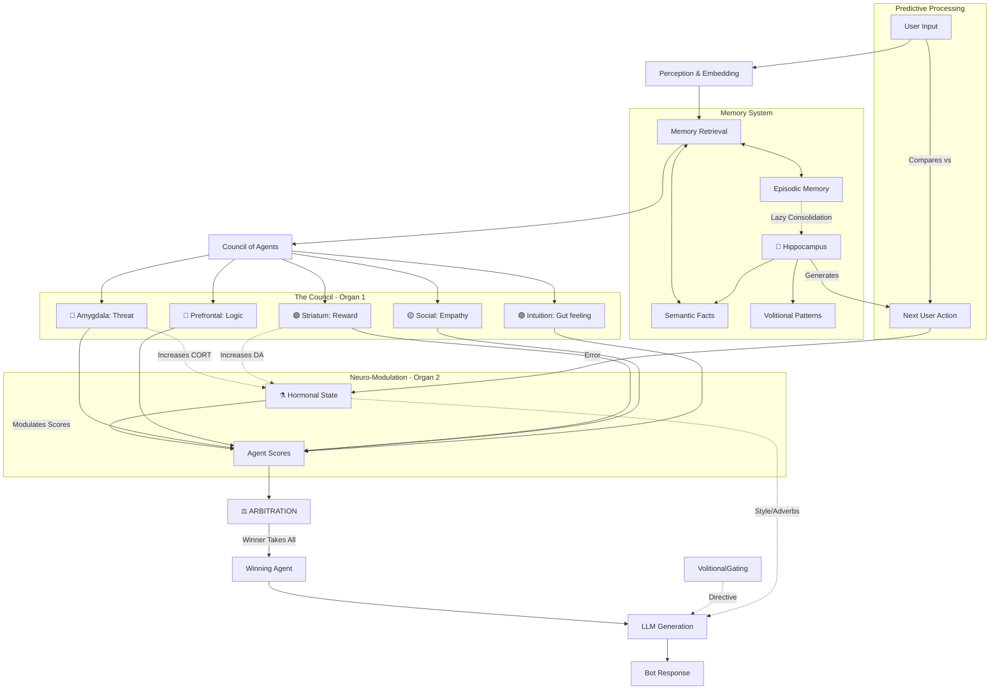

# R-Bot (Replicant)

Experimental AI cognitive architecture exploring "Artificial Psyche".
Project playground for studying human-AI interaction dynamics.

## 🧠 Core Architecture: "The Governing Organs"

This project implements a multi-agent cognitive architecture where behavior is not hardcoded but emerges from the competition of internal "organs".

### 1. The Council of Agents (Decision Making)
The primary decision-making body. Five specialized agents debate how to respond to every user message.
- 🔴 **Amygdala**: Responsible for threat detection, boundaries, and aggression.
- 🔵 **Prefrontal Cortex**: Responsible for logic, planning, and following instructions.
- 🟢 **Striatum**: Responsible for reward seeking, fun, and curiosity.
- 🟡 **Social Center**: Responsible for empathy, social norms, and politeness.
- 🟣 **Intuition (System 1)**: Fast, heuristic-based judgments.
- ⚪ **Uncertainty Agent**: Handles confusion and prediction errors (new).

### 2. Hormonal Physics (Modulation)
A biochemical layer that modulates the agents' influence.
- **DA (Dopamine)**: Boosts Striatum (reward seeking). Regulated by **Predictive Processing** accuracy.
- **NE (Norepinephrine)**: Controls arousal/alertness. Spikes on high Prediction Error (surprise).
- **CORT (Cortisol)**: Stress hormone. High CORT suppresses Prefrontal (logic) and boosts Amygdala (fight/flight).
- **5-HT (Serotonin)**: Mood stabilizer.

### 3. Hippocampus & Predictive Processing
- **Lazy Consolidation**: Background process that sleeps during dialogue and wakes up (every 20 turns) to consolidate raw episodes into semantic facts.
- **Predictive Coding**: The bot constantly generates hypotheses about the user's next move. 
    - **Low Error** (User does what expected) → **Dopamine Release** (Reward).
    - **High Error** (User surprises bot) → **Norepinephrine/Cortisol Spike** (Stress/Alertness).
- **Volitional Gating**: A mechanism that allows the bot to "force" a focus (e.g., "I want to learn about X") even if the immediate conversation drifts. It implements "Willpower" via persistence and decay.

### 4. Arbitration (The Final Verdict)
The system that weighs the votes of the Council against the hormonal state and volitional directives to choose the single "Winner Agent" that generates the final response.

---

## 🗺️ Architecture Map



## 🛠️ Development Setup

1. **Database**: PostgreSQL with `pgvector` extension.
2. **Environment**: Python 3.11+.
3. **Run**:
   ```bash
   streamlit run app_streamlit.py
   ```
