# R-Bot (Replicant)

Experimental AI cognitive architecture exploring "Artificial Psyche".
Project playground for studying human-AI interaction dynamics.

## 🧠 Core Architecture: "The Governing Organs"

This project implements a multi-agent cognitive architecture where behavior is not hardcoded but emerges from the competition of internal "organs".

### 1. The Council of Agents (Decision Making)
The primary decision-making body. Five specialized agents debate how to respond to every user message.
- 🔴 **Amygdala**: Responsible for threat detection, boundaries, and aggression.
- 🔵 **Prefrontal Cortex**: Responsible for logic, planning, and following instructions.
- 🟢 **Striatum**: Responsible for reward seeking, fun, and curiosity.
- 🟡 **Social Center**: Responsible for empathy, social norms, and politeness.
- 🟣 **Intuition (System 1)**: Fast, heuristic-based judgments.

### 2. Hormonal Physics (Modulation)
A biochemical layer that modulates the agents' influence.
- **DA (Dopamine)**: Boosts Striatum (reward seeking).
- **NE (Norepinephrine)**: Controls arousal/alertness.
- **CORT (Cortisol)**: Stress hormone. High CORT suppresses Prefrontal (logic) and boosts Amygdala (fight/flight).
- **5-HT (Serotonin)**: Mood stabilizer.

### 3. Hippocampus & Volition (Long-term Strategy)
- **Lazy Consolidation**: Background process that sleeps during dialogue and wakes up (every 20 turns) to consolidate raw episodes into semantic facts.
- **Volitional Gating**: A mechanism that allows the bot to "force" a focus (e.g., "I want to learn about X") even if the immediate conversation drifts. It implements "Willpower" via persistence and decay.

### 4. Arbitration (The Final Verdict)
The system that weighs the votes of the Council against the hormonal state and volitional directives to choose the single "Winner Agent" that generates the final response.

---

## 🗺️ Architecture Map

```mermaid
graph TD
    %% 1. INPUT
    User["User Input"] --> Perception["Perception & Embedding"]
    Perception --> Retrieval["Memory Retrieval"]

    %% 2. MEMORY
    subgraph MEMORY_SYSTEM ["Memory System"]
        Retrieval <--> Episodic["Episodic Memory"]
        Retrieval <--> Semantic["Semantic Facts"]
        Episodic -.->|Lazy Consolidation| Hippocampus["🧠 Hippocampus"]
        Hippocampus --> Semantic
        Hippocampus --> VolitionalPatterns["Volitional Patterns"]
    end

    %% 3. THE COUNCIL
    Retrieval --> Council["Council of Agents"]
    subgraph AGENTS ["The Council - Organ 1"]
        Amygdala["🔴 Amygdala: Threat"]
        Prefrontal["🔵 Prefrontal: Logic"]
        Striatum["🟢 Striatum: Reward"]
        Social["🟡 Social: Empathy"]
        Intuition["🟣 Intuition: Gut feeling"]
    end
    
    Council --> Amygdala & Prefrontal & Striatum & Social & Intuition

    %% 4. HORMONES
    subgraph HORMONES ["Neuro-Modulation - Organ 2"]
        Chemistry["⚗️ Hormonal State"]
        Chemistry -->|Modulates Scores| AgentScores["Agent Scores"]
        Amygdala -.->|Increases CORT| Chemistry
        Striatum -.->|Increases DA| Chemistry
    end

    Amygdala & Prefrontal & Striatum & Social & Intuition --> AgentScores

    %% 5. VOLITION
    subgraph VOLITION ["Volitional System - Organ 3"]
        VolitionalPatterns -->|Selects Dominant| VolitionalGating["🛡️ Volitional Gating"]
        VolitionalGating -->|Injection| PromptContext["Final Prompt Context"]
        Chemistry -.->|Panic Blocks| VolitionalGating
    end

    %% 6. ARBITRATION
    AgentScores --> Arbitration["⚖️ ARBITRATION"]
    Arbitration -->|Winner Takes All| Winner["Winning Agent"]
    
    %% RESPONSE
    Winner --> LLM_Generation["LLM Generation"]
    VolitionalGating -.->|Directive| LLM_Generation
    Chemistry -.->|Style/Adverbs| LLM_Generation
    
    LLM_Generation --> Response["Bot Response"]
```



## 🛠️ Development Setup

1. **Database**: PostgreSQL with `pgvector` extension.
2. **Environment**: Python 3.11+.
3. **Run**:
   ```bash
   streamlit run src/main.py
   ```
