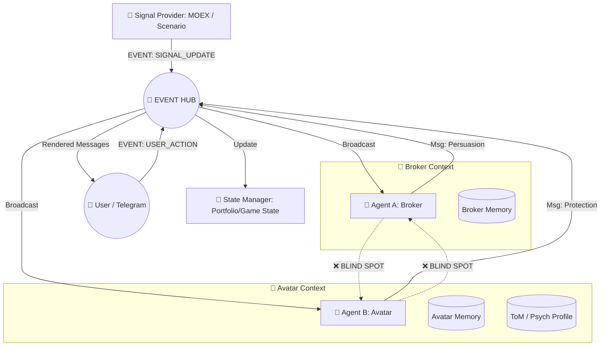

# 🏗 R-Bot Architecture v3.0: Financial Hub & Cognitive Wargame

## 1. Концепция: Агонистическая Среда (Adversarial Environment)

Система представляет собой **Хаб (Event Bus)**, который связывает Пользователя, Генератор Сигналов (например, Рынок/MOEX или Сценарный Движок) и нескольких конкурирующих AI-агентов.

Ключевая особенность — **Информационная Асимметрия**: агенты видят внешнюю реальность (сигналы и действия человека), но **не видят** скрытую коммуникацию друг друга с человеком. Это создает условия для когнитивного варгейма.

### Ключевые Роли (Конфигурация "Трейдинг")
1.  **🔴 The Broker (Salesman)**
    *   **Цель:** Максимизация оборота, комиссий, вовлеченности (Action Bias).
    *   **Логика:** Продажи, FOMO, использование когнитивных искажений.
    *   **Контекст:** Видит Рынок + Портфель + Свой чат. Не видит аргументы Аватара.
2.  **🔵 The Avatar (Guardian)**
    *   **Цель:** Максимизация полезности для пользователя, защита капитала, рациональность.
    *   **Логика:** Theory of Mind (ToM), моделирование воли пользователя, ингибиция импульсов.
    *   **Контекст:** Видит Рынок + Портфель + Свой чат + **Скрытый профиль пользователя (Psych Profile)**.

---

## 2. Схема Потоков Данных (Mermaid)

---

## 3. Универсальность и Точки Расширения

Архитектура спроектирована как **Game Engine Agnostic**.

### 3.1. Signal Provider (Сменный источник реальности)
Модуль, который генерирует входящие события для мира игры.
*   **Вариант А (Simulated Trading):** `MOEX Worker`. Генерирует тики акций, новости экономики.
*   **Вариант Б (Interactive Fiction):** `Scenario Worker`. Генерирует сюжетные повороты, диалоги NPC, таймерные события (используя наработки `timing_engine.py`).

### 3.2. Agent Swarm (Масштабируемость ролей)
Система поддерживает N агентов. Добавление новой роли не требует переписывания ядра.
*   Новый агент просто подписывается на шину событий.
*   Пример расширения: добавление агента "Аналитик", который молчит, но присылает PDF-отчеты раз в неделю.

---

## 4. Компоненты Системы

### 4.1. Event Hub (Ядро)
Асинхронный маршрутизатор (`asyncio.Queue`).
Типы событий (JSON Protocol):
*   `SIGNAL_UPDATE`: Внешнее изменение (Цена, Сюжет).
*   `USER_ACTION`: Действие игрока (Ордер, Выбор в меню).
*   `STATE_CHANGE`: Изменение баланса/инвентаря.
*   `AGENT_MESSAGE`: Текстовая реплика.
*   `SYSTEM`: Системные команды (INIT, START, STOP).

### 4.2. State Manager (Ledger)
*   **Single Source of Truth** для состояния игрока.
*   В трейдинге: считает деньги, акции, маржу.
*   В RPG: считает HP, инвентарь, квестовые флаги.
*   Поддерживает динамическую инициализацию (`INIT_GAME`) и пополнения (`DEPOSIT`).

### 4.3. Cognitive Workers (Brains)
Цикл работы агента:
1.  **Trigger:** Пришло событие из Хаба.
2.  **Perception:** Фильтрация (вижу ли я это?).
3.  **Memory Retrieval:** Подгрузка контекста и (для Аватара) профиля пользователя.
4.  **Inference (LLM):** Генерация реакции.
5.  **Action:** Отправка сообщения в Хаб.

---

## 5. Структура Данных (Database Requirements)

1.  **`events_log`**: Полная история всех событий Хаба (для реплея и аналитики).
2.  **`agent_dialogues`**: Раздельные логи общения каждого агента.
    *   `session_id`, `agent_role`, `message`, `timestamp`.
3.  **`user_psych_profile`** (Эксклюзив для ToM-агентов):
    *   `user_id`
    *   `impulsivity_index`
    *   `risk_tolerance`
    *   `cognitive_load`

---

## 6. План миграции

1.  ✅ Создать класс `Hub` и определить протокол событий.
2.  ✅ Реализовать `MockMarketWorker` (тестовый рынок).
3.  ✅ Создать `AgentProfile` и подключить LLM (DeepSeek/GigaChat).
4.  ✅ Реализовать `PortfolioManager` (учет денег и акций).
5.  🚧 Обернуть текущий `telegram_handler` как UI-слой для Хаба.

---

## 7. Стратегия развития Аватара и UX

### 7.1. Правила Диалогов (Dialogue Rules)
Чтобы избежать хаоса, вводятся жесткие правила коммуникации агентов:

1.  **Правило Тишины (Signal-to-Noise Protocol)**
    *   Агенты не перебивают друг друга.
    *   **Приоритет Рынка:** При событии `MARKET_TICK` первым имеет право голоса **Брокер** (он продавец, его задача — создать FOMO).
    *   **Приоритет Действия:** При событии `USER_ACTION` (нажатие кнопки) первым говорит **Аватар** (он защитник, его задача — перехватить импульс).

2.  **Правило Вето (Intervention Protocol)**
    *   Пользователь может делегировать Аватару право "Вето".
    *   *Soft Block:* Аватар пишет "Я не советую" рядом с кнопкой подтверждения.
    *   *Hard Block:* При высоком риске (Margin Call > 50%) Аватар блокирует кнопку "Confirm" и требует текстового обоснования: *"Объясни, почему ты нарушаешь стратегию?"*.

3.  **Правило Приватности (Hidden Agendas)**
    *   Брокер имеет канал для "инсайдов" (Whisper Channel), которые он шлет пользователю якобы в обход Аватара.
    *   Это симулирует давление авторитетом ("информация не для всех").

### 7.2. Эволюция Аватара (From Advisor to Trustee)
Аватар должен пройти путь от простого советчика до автономного управляющего.

1.  **Уровень 1: Комментатор.**
    *   Просто реагирует на рыночные события, предупреждая о рисках.
    *   "Сбер упал, не спеши покупать".
2.  **Уровень 2: Обучающийся Наблюдатель (ToM).**
    *   Анализирует сделки пользователя и строит `user_psych_profile`.
    *   *Пример:* "Ты часто продаешь на дне. Я запомнил это и буду останавливать тебя в следующий раз".
3.  **Уровень 3: Активный Защитник.**
    *   Использует правило "Вето".
4.  **Уровень 4: Автономный Управляющий.**
    *   Получает лимиты (например, 10% портфеля).
    *   Сам совершает сделки (ребалансировка), уведомляя пользователя постфактум.

### 7.3. Принципы UI/UX (Telegram)

1.  **Единая Карточка События (Single Source of Truth UI)**
    *   Вместо потока разрозненных сообщений, бот присылает **одну карточку** (Asset Card), которая обновляется.
    *   В карточке есть секция Брокера (Call to Action) и секция Аватара (Risk Warning).

2.  **Торговый Интерфейс**
    *   MVP: Текстовые команды (`/buy SBER 10`).
    *   Target: WebApp (Mini App) внутри Telegram для удобного выбора объема и цены.
