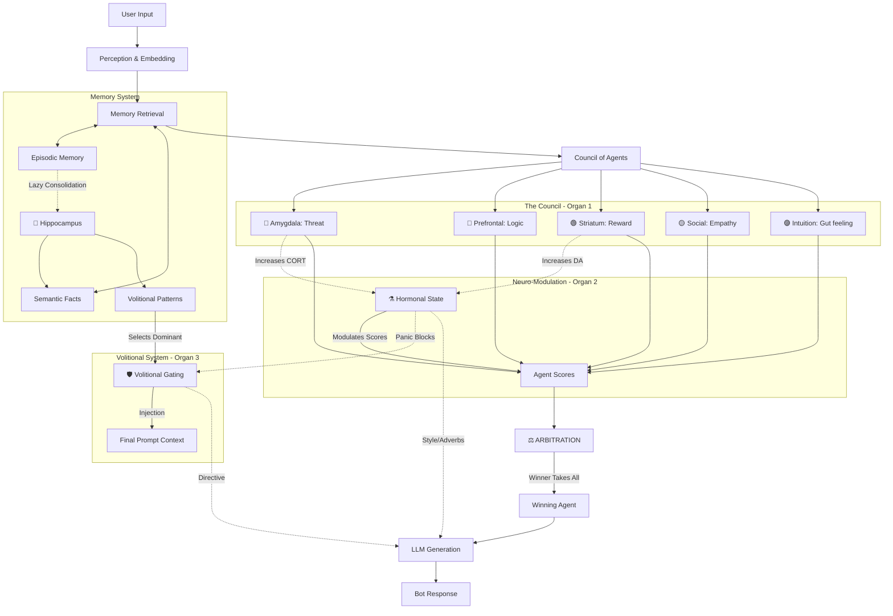

# R-Core Behavior Control Map

Цель: зафиксировать "карту управления поведением" R-Core для совместного обсуждения (психолог, матлингвист, разработка).
Карта описывает входы, обработку (Council + Neuro‑Modulation + Volition), промпты и выходы, а также ветку экстренных состояний.

## Mermaid diagram

## Блоки и ответственность

### Inputs
- User message: сырой текст + метаданные канала.
- User Profile: стабильные атрибуты пользователя (включая preferred_mode).
- Semantic/Episodic Memory: извлечённые факты и эпизоды, подходящие под текущий запрос.
- Volitional Patterns: паттерны "триггер‑импульс‑стратегия" + приоритеты/затухание (используются для фокусировки).
- Chat History: последние N сообщений для локальной когерентности.

### Background (Hippocampus)
- Hippocampus запускается асинхронно и обновляет семантику и волевые паттерны без задержки ответа.

### Processing
- Context Builder: собирает единый контекст и "фичи" для Council и Volition.
- State Estimation: оценивает текущее состояние диалога/пользователя (норма vs экстрим).
- Volition Selector: выбирает доминирующий импульс (gating) и удерживает его (persistence) несколько ходов.
- Council: 5 агентов дают независимые оценки/планы реакции.
- Neuro‑Modulation: гормоны корректируют веса/оценки (особенно в экстремальных режимах).
- Winner Selection: выбирает победителя с максимальным score с учётом ограничений политики.

### Prompts
- System Prompt: роль, ценности, запреты.
- Agent Prompt: инструкция выбранному агенту (что делать).
- Volitional Directive: волевая линия (что удерживать/какую цель не терять).
- Style Modifiers: тон/эмпатия/ритм из архетипа (CALM/RAGE/FEAR/...).

### Output
- Final Response: текст пользователю.
- Internal Stats: логируемые метрики (agent scores, гормоны, архетип, выбранная воля, persistence, latency, токены).

## Экстренные состояния
Экстренный контур нужен, если State Estimation фиксирует "опасную" зону (например, PFC shutdown, burnout, panic).
Он:
1) снижает сложность ответа (короче, яснее),
2) форсирует деэскалацию и поддержку,
3) может временно "перекрывать" Winner Selection и Volition.

## Time Machine (опционально)
Time Machine — отдельный модуль, если вы хотите явно обозначить:
- "откат" к предыдущим гипотезам/фактам,
- контрфактуальную проверку ("а если мы ошиблись?"),
- восстановление цепочки событий (timeline) из Episodic Memory.
Если сейчас это не в приоритете, блок можно оставить как optional.
