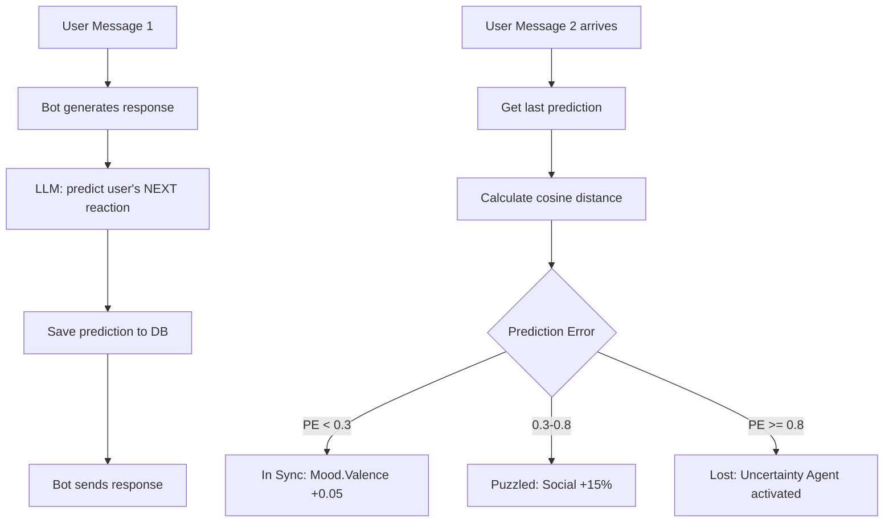

# 🔮 Predictive Processing: Empathy Feedback Loop

**Статус**: ✅ В разработке (Этап 2.2)  
**Дата**: 08.02.2026  
**Версия**: 1.0

---

## 🎯 Концепция

**Predictive Processing** — это механизм, который позволяет R-Bot **прогнозировать следующую реакцию пользователя** и использовать **ошибку прогноза** (prediction error) для адаптации поведения.

### Базовая Идея (из нейронауки)

**Predictive Coding Theory**:
1. Мозг постоянно **предсказывает** следующий сенсорный вход
2. Сравнивает прогноз с реальностью → **prediction error (PE)**
3. **Большая ошибка** → сигнал "модель мира сломана" → изменение поведения

---

## 🏗️ Архитектура



---

## 📊 Empathy Alignment

**Empathy Alignment (EA)** — это инверсия Prediction Error:

```python
empathy_alignment = 1.0 - prediction_error

# Примеры:
# EA = 1.0 (100%) → Perfect alignment (PE = 0.0)
# EA = 0.7 (70%)  → Good alignment (PE = 0.3)
# EA = 0.2 (20%)  → Misaligned (PE = 0.8)
```

**Интерпретация**:
- **High EA** → Бот правильно понимает собеседника
- **Low EA** → Модель пользователя неверна, нужна коррекция

---

## 🎭 Поведенческие Состояния

### 1️⃣ **In Sync** (PE < 0.3, EA > 70%)

**Описание**: Бот **в потоке** с пользователем — прогнозы точные.

**Влияние на систему**:
```python
# Mood Changes
mood.valence += 0.05      # Удовлетворение от точного прогноза
mood.dominance += 0.03    # Уверенность в понимании собеседника

# Agent Modifiers: НЕТ (всё работает штатно)
```

**Поведение бота**:
- Более уверенные формулировки
- Может углубляться в тему без переспросов
- Striatum Reward активируется → проактивность

**Пример**:
```
Bot prediction: "Пользователь спросит про фреймворки Python"
User actual:    "А какие фреймворки есть для Python?"
PE = 0.15 → In Sync ✅
```

---

### 2️⃣ **Neutral** (0.3 <= PE < 0.6, EA 40-70%)

**Описание**: Обычный диалог, без сюрпризов.

**Влияние на систему**:
```python
# Mood Changes: НЕТ
# Agent Modifiers: НЕТ
```

**Поведение бота**: Штатное, без изменений.

---

### 3️⃣ **Puzzled** (0.6 <= PE < 0.8, EA 20-40%)

**Описание**: Лёгкая озадаченность — бот примерно угадал направление, но детали отличаются.

**Влияние на систему**:
```python
# Mood Changes
mood.valence -= 0.05      # Лёгкий дискомфорт
mood.arousal += 0.1       # Повышение бдительности
mood.dominance -= 0.05    # Лёгкое снижение уверенности

# Agent Modifiers
Social Cortex: × 1.15     # +15% (усиление эмпатии)
Intuition: × 0.9          # -10% (интуиция не сработала)
```

**Поведение бота**:
- Больше внимания к эмоциональному контексту
- Social Cortex чаще побеждает → больше вопросов, уточнений

**Пример**:
```
Bot prediction: "Пользователь спросит про сложность изучения"
User actual:    "А сколько времени займёт обучение?"
PE = 0.72 → Puzzled ⚠️
```

---

### 4️⃣ **Lost** (PE >= 0.8, EA < 20%)

**Описание**: Бот **потерял нить диалога** — модель пользователя сломана.

**Влияние на систему**:
```python
# Mood Changes (тревога)
mood.valence -= 0.1       # Дискомфорт
mood.arousal += 0.2       # Тревога (высокая активация)
mood.dominance -= 0.15    # Снижение уверенности

# Agent Modifiers (усиленная коррекция)
Social Cortex: × 1.3      # +30%
Intuition: × 0.6          # -40% (интуиция подвела)
Prefrontal: × 0.9         # -10% (меньше директивности)

# Uncertainty Agent АКТИВИРУЕТСЯ
uncertainty_agent.score = 7.5  # Высокий приоритет → скорее всего победит
```

**Поведение бота**:
- 🚨 **Uncertainty Agent побеждает** → режим переспрашивания
- Задаёт 1-2 уточняющих вопроса
- Использует фразы: "Хочешь узнать больше о...", "Тебя интересует..."
- Избегает assumptions (не додумывает за пользователя)

**Пример**:
```
Bot prediction: "Пользователь спросит про фреймворки"
User actual:    "Расскажи про погоду в Москве"
PE = 0.95 → Lost 🚨
→ Uncertainty Agent: "Переключились на погоду? Хочешь прогноз на сегодня или на неделю?"
```

---

## 🔧 Конфигурация

### Пороги (Thresholds)

Все пороги настраиваются через **переменные окружения** (см. `.env.example.behavioral`):

```bash
# Пороги состояний
PE_THRESHOLD_IN_SYNC=0.3   # PE < 0.3 → In Sync
PE_THRESHOLD_LOST=0.8      # PE >= 0.8 → Lost
# Диапазон 0.3-0.8 → Puzzled
```

### Коэффициенты Mood

```bash
# In Sync
MOOD_IN_SYNC_VALENCE=0.05
MOOD_IN_SYNC_AROUSAL=0.0
MOOD_IN_SYNC_DOMINANCE=0.03

# Puzzled
MOOD_PUZZLED_VALENCE=-0.05
MOOD_PUZZLED_AROUSAL=0.1
MOOD_PUZZLED_DOMINANCE=-0.05

# Lost
MOOD_LOST_VALENCE=-0.1
MOOD_LOST_AROUSAL=0.2
MOOD_LOST_DOMINANCE=-0.15
```

### Модификаторы Агентов

```bash
# Puzzled (0.6 < PE < 0.8)
AGENT_MOD_PUZZLED_SOCIAL=1.15
AGENT_MOD_PUZZLED_INTUITION=0.9

# Lost (PE >= 0.8)
AGENT_MOD_LOST_SOCIAL=1.3
AGENT_MOD_LOST_INTUITION=0.6
AGENT_MOD_LOST_PREFRONTAL=0.9
```

### Uncertainty Agent

```bash
UNCERTAINTY_ACTIVATION_THRESHOLD=0.8  # Активация при PE >= 0.8
UNCERTAINTY_ACTIVE_SCORE=7.5          # Score при активации
UNCERTAINTY_INACTIVE_SCORE=1.0        # Score в неактивном состоянии
```

---

## 💻 Использование в Коде

### Импорт Конфигурации

```python
from src.r_core.behavioral_config import behavioral_config

# Получить текущее состояние
pe = 0.75
state = behavioral_config.get_state_name(pe)  # "puzzled"

# Получить изменения Mood
mood_changes = behavioral_config.get_mood_adjustments(pe)
# → {"valence": -0.05, "arousal": 0.1, "dominance": -0.05}

# Получить модификаторы агентов
agent_mods = behavioral_config.get_agent_modifiers(pe)
# → {"social_cortex": 1.15, "intuition_system1": 0.9}
```

### В Pipeline

```python
# В pipeline.py → process_message()

# 1. Проверить prediction от прошлого ответа
pe = await self._check_last_prediction(message)

# 2. Применить Mood adjustments
mood_adj = behavioral_config.get_mood_adjustments(pe)
self.current_mood.valence += mood_adj["valence"]
self.current_mood.arousal += mood_adj["arousal"]
self.current_mood.dominance += mood_adj["dominance"]

# 3. Получить Agent modifiers
agent_mods = behavioral_config.get_agent_modifiers(pe)

# 4. Применить модификаторы к scores
for agent_type, modifier in agent_mods.items():
    signals[agent_type].score *= modifier

# 5. Uncertainty Agent получит PE из context
context["prediction_error"] = pe
```

---

## 📊 Таблица Интенций

| PE Range | State | Mood Changes | Agent Modifiers | Resulting Intent |
|----------|-------|--------------|-----------------|------------------|
| **<0.3** | ✅ In Sync | `V:+0.05, D:+0.03` | — | "Я понимаю тебя → углубляюсь в тему" |
| **0.3-0.6** | ⚪ Neutral | — | — | "Всё нормально, продолжаю" |
| **0.6-0.8** | ⚠️ Puzzled | `V:-0.05, A:+0.1, D:-0.05` | Social +15%<br>Intuition -10% | "Слушаю внимательнее, усиливаю эмпатию" |
| **>=0.8** | 🚨 Lost | `V:-0.1, A:+0.2, D:-0.15` | Social +30%<br>Intuition -40%<br>**Uncertainty activated** | "Не понимаю → задаю уточняющие вопросы" |

---

## 🎨 UI Визуализация (Streamlit)

### Empathy Alignment Panel

```python
# В app_streamlit.py

st.subheader("🔮 Empathy Alignment")

pe = st.session_state.kernel_instance.last_prediction_error
ea = 1.0 - pe  # Empathy Alignment

col1, col2 = st.columns(2)
with col1:
    st.metric("Alignment", f"{ea:.0%}")
with col2:
    if pe < 0.3:
        st.success("✅ In Sync")
    elif pe < 0.6:
        st.info("⚪ Neutral")
    elif pe < 0.8:
        st.warning("⚠️ Puzzled")
    else:
        st.error("🚨 Lost")

# Progress bar
st.progress(ea, text=f"Understanding: {ea:.0%}")
```

**Пример отображения**:
```
┌─────────────────────────────────────┐
│ 🔮 Empathy Alignment                │
├─────────────────────────────────────┤
│  Alignment: 73%    |  ⚠️ Puzzled    │
├─────────────────────────────────────┤
│ [████████████░░░░░░] 73%            │
└─────────────────────────────────────┘
```

---

## 🧪 Тестовый Сценарий

```python
# Диалог 1: Высокая точность
User: "Какой язык программирования лучше?"
Bot:  "Рекомендую Python — универсален и имеет большое комьюнити."
      [Prediction: "Пользователь спросит про фреймворки или сложность"]

User: "А он сложный в изучении?"
      [PE = 0.18 → In Sync ✅]
      [Mood: V+0.05, D+0.03]
      [Behaviour: Уверенный, углубляется в тему]

# Диалог 2: Смена темы
User: "Расскажи про погоду"
      [PE = 0.92 → Lost 🚨]
      [Mood: V-0.1, A+0.2, D-0.15]
      [Uncertainty Agent: score=7.5 → побеждает]
      
Bot:  "Переключились на погоду? Хочешь прогноз на сегодня или на неделю?"
      [Стиль: задаёт уточняющий вопрос вместо assumptions]
```

---

## 🛠️ Техническая Реализация

### База Данных

```sql
CREATE TABLE prediction_history (
    id SERIAL PRIMARY KEY,
    user_id INTEGER NOT NULL,
    session_id VARCHAR(64) NOT NULL,
    bot_message TEXT NOT NULL,
    predicted_reaction TEXT NOT NULL,
    predicted_embedding VECTOR(1536),
    actual_message TEXT,
    actual_embedding VECTOR(1536),
    prediction_error FLOAT,
    created_at TIMESTAMP DEFAULT NOW(),
    verified_at TIMESTAMP,
    
    INDEX idx_session_latest (session_id, created_at DESC)
);
```

### LLM Prompt Extension

```python
# В llm.py → generate_response()

system_prompt += """
--- PREDICTIVE PROCESSING ---
After generating your response, briefly predict the user's likely next reaction.
Focus on:
- Will they ask a follow-up question? (What topic?)
- Will they agree/disagree?
- Will they change the subject?

Return JSON:
{
  "response": "your bot response here",
  "user_reaction_prediction": "User will likely ask about frameworks or difficulty"
}
"""
```

### Calculation of Prediction Error

```python
# В pipeline.py

async def _check_last_prediction(self, message: IncomingMessage) -> float:
    """
    Сравнить prediction с фактическим сообщением.
    
    Returns:
        prediction_error (0.0 - 1.0)
    """
    last_pred = await self.memory.get_last_prediction(message.session_id)
    
    if not last_pred:
        return 0.5  # Нет prediction → нейтральное значение
    
    # Cosine distance между predicted и actual embeddings
    predicted_emb = last_pred["predicted_embedding"]
    actual_emb = await self.memory.get_embedding(message.text)
    
    similarity = cosine_similarity(predicted_emb, actual_emb)
    prediction_error = 1.0 - similarity  # Инверсия
    
    # Сохранить результат
    await self.memory.verify_prediction(
        prediction_id=last_pred["id"],
        actual_message=message.text,
        error=prediction_error
    )
    
    return prediction_error
```

---

## 🔬 Метрики

### В internal_stats

```json
{
  "prediction_error": 0.73,
  "empathy_alignment": 0.27,
  "empathy_state": "puzzled",
  "mood_adjustment": {"valence": -0.05, "arousal": 0.1, "dominance": -0.05},
  "agent_modifiers_applied": {"social_cortex": 1.15, "intuition_system1": 0.9}
}
```

### Логирование в БД

```sql
-- Добавлено в rcore_metrics
ALTER TABLE rcore_metrics 
ADD COLUMN prediction_error FLOAT,
ADD COLUMN empathy_alignment FLOAT,
ADD COLUMN empathy_state VARCHAR(16);
```

---

## 📚 Дополнительные Ресурсы

- **Код конфигурации**: [src/r_core/behavioral_config.py](../src/r_core/behavioral_config.py)
- **Примеры настройки**: [.env.example.behavioral](../.env.example.behavioral)
- **Архитектура R-Core**: [docs/r-core.md](./r-core.md)
- **Affective ToM**: [docs/affective-tom-guide.md](./affective-tom-guide.md)

---

## 🚀 Roadmap

- ✅ **Task 1**: Configuration setup (`behavioral_config.py`).
- ⏳ **Task 2 (Current)**: Implement `Uncertainty Agent` class.
- ⏳ **Task 3**: Add DB tables (`prediction_history`).
- ⏳ **Task 4**: Add LLM logic for `user_reaction_prediction`.
- ⏳ **Task 5**: Pipeline integration (PE Calculation).

---

**Автор**: R-Core Team  
**Дата создания**: 08.02.2026, 01:43 MSK
